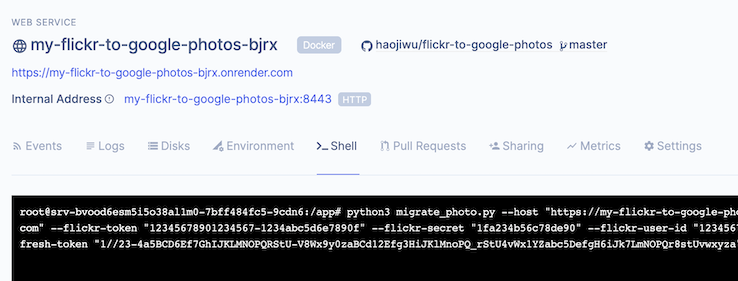

# Flickr to Google Photos
Tool for photo and album migration from Flickr to Google Photos. Photo metadata like title, dscription, tag and geotag will also be migrated.

Example:


## Table of Contents
  * [Description](#description)
  * [Build with](#build-with)
  * [Prerequisites](#prerequisites)
  * [Setup (Render)](#setup-render)
  * [Setup (Local or Docker)](#setup-local-or-docker)
  * [Quick start](#quick-start)
  * [Usage](#usage)
     * [Get Flickr credential](#get-flickr-credential)
     * [Get Google credential](#get-google-credential)
     * [Get Flickr photos metadata with download URL](#get-flickr-photos-metadata-with-download-url)
     * [Create photo entities in Google Photos](#create-photo-entities-in-google-photos)
     * [Get Flickr albums metadata with photo associations](#get-flickr-albums-metadata-with-photo-associations)
     * [Create album in Google Photos](#create-album-in-google-photos)
  * [Notes](#notes)
     * [Video](#video)
     * [Database](#database)
     * [Performance](#performance)
     * [Local photos](#local-photos)
     * [Feedback](#feedback)

## Description
This project implements the following features to achieve migration from Flickr to Google Photos.
1. Flickr and Google oauth request builder and callback endpoint.
2. RESTFul APIs to download all Flickr photos and upload to Google Photos, with following Flickr photo metadata:
   - Title
   - Description
   - Tags
   - Geotagging (add geotagging to photo's EXIF if the user has manually added location in Flickr.)
3. RESTFul APIs to get all Flickr albums, including album-photo associations and album metadata, and create corresponding album in Google Photos with following Flickr album metadata:
   - Title
   - Description
   - Cover photo
4. Optionally force create unique photo in Google Photos by modifying photo's EXIF.
5. Support video migration with limitations.  

You can deploy this project to local JVM-ready environment. This project also provides Dockerfile to be built and run in docker container. You can easily dpeloy this project to [Render](https://render.com/).

## Build with
- Java 8
- [Spring Boot](https://spring.io/projects/spring-boot)
- Maven
- [H2 Database](https://www.h2database.com) or [PostgreSQL](https://www.postgresql.org/)
- [Flickr4Java](https://github.com/boncey/Flickr4Java)
- [google-photos-library-client](https://github.com/google/java-photoslibrary) [guide](https://developers.google.com/photos/library/guides/get-started-java#get-library)
- [Apache Commons Imaging](https://github.com/apache/commons-imaging)
- (Optional) Python3 and PIP3 for migration script
- (Optional) [Docker Desktop](https://www.docker.com/) for Dokcer deployment

## Prerequisites
- Your own Flickr app credential
  1. Create an app with any name in https://www.flickr.com/services/apps/create/noncommercial. After submitting, you will get **key** and **secret**.
  2. Click **Edit auth flow for this app** and update **Callback URL** with `https://localhost:8443/flickr/auth/complete`. 
- Your own Google App credential
  1. Create or config your Google project with Google Photos Library API. You can find more detailed instructions in https://developers.google.com/photos/library/guides/get-started.
  2. Update **Authorized redirect URI** with `https://localhost:8443/google/auth/complete`.
- JDK 1.8+ and Maven 3.3+ installed if you will develop and deploy in the local environment.
- Generate a self-signed SSL certificate if you don't have a real SSL Certificate. Skip it if you want to deploy to [Render](https://render.com/) since Render provides fully managed SSL certificate.   
  Flickr oauth callback requires HTTPS URL. To enable HTTPS in Spring Boot we need an SSL certificate. If you don't have one, you can generate a self-signed SSL certificate. Of course it can only be used in local deployment.
  
  ```
  keytool -genkeypair -alias my_dev -keyalg RSA -keysize 2048 -storetype PKCS12 -keystore my_dev.p12 -validity 3650
  ```
  
  This command will ask you input password (`my_password` as my example) and some other information (you can skip all of them except password) and generate `my_dev.p12`, which is your keystore file. This keystore file and password will be used when configuring project's application properties. You can find more informatin in https://www.baeldung.com/spring-boot-https-self-signed-certificate.
 
## Setup (Render)
You can deploy this project to [Render](https://render.com/) with one click. Render is a platform-as-a-service provider with clear and easy-to-use UI. After clicking the button, Render will clone this repository, build and deploy base on [Dockerfile.render](Dockerfile.render) and [render.yaml](render.yaml) which describes web service and PostgreSQL database configuration.

[](https://render.com/deploy)

Render will prompt to request you to enter `FLICKR_KEY` and `FLICKR_SECRET` from your Flickr app and `GOOGLE_CLIENT_ID` and `GOOGLE_CLIENT_SECRET` from your Google app as environment variables. 


It is all set. In the new created `my-flickr-to-google-photos-XXXX (XXXX is random string)` web service there will be URL like `https://my-flickr-to-google-photos-XXXX.onrender.com`. This is API host you can use to do Flickr and Google authorization and migrate photos and albumes. Remember to update **Callback URL** in your Flickr app and **Authorized redirect URI** in your Google App with this API endpoint.

[Dockerfile.render](Dockerfile.render) contains python and PostgreSQL client. You can execute migration script in this service's web shell:
```
python3 migrate_photo.py --host "https://my-flickr-to-google-photos-XXXX.onrender.com" --flickr-token "12345678901234567-1234abc5d6e7890f" --flickr-secret "1fa234b56c78de90" --flickr-user-id "12345678@N00" --google-refresh-token "1//23-4a5BCD6Ef7GhIJKLMNOPQRStU-V8Wx9y0zaBCd12Efg3HiJKlMnoPQ_rStU4vWx1YZabc5DefgH6iJk7LmNOPQr8stUvwxyza"
```




## Setup (Local or Docker)

1. Clone this project to local. Go to the project folder.
   ```
   git clone git@github.com:haojiwu/flickr-to-google-photos.git
   cd flickr-to-google-photos
   ```
2. Copy keystore (`my_dev.p12` in previous example) to the project folder.
3. Configure project's application properties in `src/main/resources/application-dev.properties` or `src/main/resources/application-docker.properties`.
   - Add SSL properties.
   ```
   server.ssl.key-store=my_dev.p12 # make sure you put it in the root of project folder
   server.ssl.key-store-password=my_password  # the value you entered when keytool asked 
   server.ssl.key-alias=my_dev
   ```
   - Add the Flickr key and secret, which are from the Flickr App you created.
   ```
   app.flickr.key=a1b234567b89c012d3e4f5ab67c8901d
   app.flickr.secret=12ab345c6d789e0f
   ```
   - Add Google client id and client secret, which are from the Google project you created with Google Photos Library enabled. [Here](https://developers.google.com/photos/library/guides/get-started) are detailed steps to find them.
   ```
   app.google.clientId=123456789012-abcd3ef45g6h70ijkl89m0n1o2pqrstu.apps.googleusercontent.com
   app.google.clientSecret=12Ab3CDe4FGhIjklMnopQRST
   ```
4. In the project folder launch application.
   - For local deployment.
   ```
   ./mvnw spring-boot:run
   ```
   - To build and run docker containser (set `KEYSTORE_PATH` to your keystore file).
   ```
   docker build -f Dockerfile -t my/flickr-to-google-photos --build-arg KEYSTORE_PATH=./my_dev.p12 . --no-cache
   docker run -d -p 8443:8443 --mount source=db,target=/db my/flickr-to-google-photos 
   ```
## Quick start
API host
- Local: `https://localhost:8443`
- Docker: `https://localhost:8443`
- Render: `https://my-flickr-to-google-photos-XXXX.onrender.com`, which can be found from your Render web service page.

Script to migrate all photos and albums
1. Open browser to visit `<API host>/flickr/auth`. After authorization flow you will have Flickr credential.
2. Open browser to visit `<API host>/google/auth`. After authorization flow you will have Google credential.
3. Make sure your environment has python and [PIP](https://pip.pypa.io/en/stable/).
4. Install python library `Requests`.
   ```
   pip3 install requests
   ```
5. Execute script to migrate photos. Use Google credential and Flickr credential from step 1 and 2.
   ```
   python3 migrate_photo.py --host "<API host>" --flickr-token "12345678901234567-1234abc5d6e7890f" --flickr-secret "1fa234b56c78de90" --flickr-user-id "12345678@N00" --google-refresh-token "1//23-4a5BCD6Ef7GhIJKLMNOPQRStU-V8Wx9y0zaBCd12Efg3HiJKlMnoPQ_rStU4vWx1YZabc5DefgH6iJk7LmNOPQr8stUvwxyza"
   ```
6. Execute script to migrate albums. Use Google credential and Flickr credential from step 1 and 2.
   ```
   python3 migrate_album.py --host "<API host>" --flickr-token "12345678901234567-1234abc5d6e7890f" --flickr-secret "1fa234b56c78de90" --flickr-user-id "12345678@N00" --google-refresh-token "1//23-4a5BCD6Ef7GhIJKLMNOPQRStU-V8Wx9y0zaBCd12Efg3HiJKlMnoPQ_rStU4vWx1YZabc5DefgH6iJk7LmNOPQr8stUvwxyza"
   ```

## Usage
API host
- Local: `https://localhost:8443`
- Docker: `https://localhost:8443`
- Render: `https://my-flickr-to-google-photos-XXXX.onrender.com`, which can be found from your Render web service page.

### Get Flickr credential
1. Open browser to visit `<API host>/flickr/auth`.
2. Browser will be redirected to the Flickr authorization page.
3. After you accept it, the browser will be redirected back to `<API host>/flickr/auth/complete` and return `FlickrCredential` which contains `userId`, `token` and `secret`.
   ```
   {
       "userId": "12345678@N00",
       "token": "12345678901234567-1234abc5d6e7890f",
       "secret": "1fa234b56c78de90"
   }
   ```
### Get Google credential
1. Open browser to visit `<API host>/google/auth`.
2. Browser will be redirected to Google authorization page. There may be a warning like `This app isn't verified`. Ignore it by clicking `Advanced` and `Go to` your app.
3. After you allow authorization with permissions, the browser will be redirected back to `<API host>/google/auth/complete` and return `GoogleCredential` which contains `accessToken` and `refreshToken`. We only need `refreshToken`.
   ```
   {
       "accessToken": "ya12.a3AfH4SMCPonW5F6VHAH7L_oGsb0NwTgDCQQElPrG-8H90flJatx1RELxHPf12ydBKSwi-WH34mHh56jJFU7z89bayrvogNX-Z0PEdmM1gLMQWGfLW23yqbCStvsYp4gcJ5n6cox_nVc7rfGan8SfRiSwtqhg9Kik0Szo",
       "refreshToken": "1//23-4a5BCD6Ef7GhIJKLMNOPQRStU-V8Wx9y0zaBCd12Efg3HiJKlMnoPQ_rStU4vWx1YZabc5DefgH6iJk7LmNOPQr8stUvwxyza"
   }
   ```
### Get Flickr photos metadata with download URL
- Endpoint: `<API host>/flickr/photo`
- Method: GET
- Parameters:
  - `token`: Flickr token from Flickr credential.
  - `secret`: Flickr secret from Flickr credential.
  - `page`: Page number starting from **1** (it is not programmer friendly, but follows Flickr API's design). Each page has 500 photos.
  ```bash
  # token: 12345678901234567-1234abc5d6e7890f
  # secret: 1fa234b56c78de90
  # page: 1
  # add "-k" to ignore SSL verification 
  curl -k -X GET "<API host>/flickr/photo?token=12345678901234567-1234abc5d6e7890f&secret=1fa234b56c78de90&page=1"
  {
      "flickrPhotos": [ # Array of Flickr photos. If this is not last page, the array will have 500 elements.
          {
              "id": "12345678901", # Flickr photo id
              "url": "https://flickr.com/photos/12345678@N00/12345678901", # Flickr URL of this photo
              "downloadUrl": "https://farm66.staticflickr.com/65535/12345678901_af1ccf9d71_o.jpg", # URL to download this photo
              "title": "My photo title", # Flickr photo title
              "description": "My photo description", # Flickr photo description
              "latitude": 40.707294, # GPS latitude of Flickr photo geotagging 
              "longitude": -74.01037, # GPS longitude of Flickr photo geotagging 
              "tags": [ # Array of Flickr photo tags
                  "tag1",
                  "tag2"
              ],
              "media": "PHOTO" # PHOTO or VIDEO (both are uppercase)
          },
          ...
      ],
      "total": 13110, # Number of total photos in Flickr
      "page": 1, # Page number
      "pageSize": 500, # Page size
      "hasNext": true # Boolean flag to tell if this is last page, or user needs to send another request with next page number.
  }        
  ```
### Create photo entities in Google Photos
- Endpoint: `<API host>/google/photo`
- Method: POST
- Parameters:
  - `refreshToken`: Google refresh token token from Google credential.
  - `forceUnique`: Optional boolean flag to add unique string (timestamp) to UserComment field in EXIF to make photo unique in terms of checksum. By default it is `false`.
- Body: Json array of objects with Flickr photo metadata and download URL (the same as `flickrPhotos` field in `/flickr/photo` response). The max size of this array is 50, which is Google Photo API limit.
  ```bash
  #refreshToken: 1//23-4a5BCD6Ef7GhIJKLMNOPQRStU-V8Wx9y0zaBCd12Efg3HiJKlMnoPQ_rStU4vWx1YZabc5DefgH6iJk7LmNOPQr8stUvwxyza
  curl -k -X POST \
    '<API host>/google/photo?refreshToken=1%2F%2F23-4a5BCD6Ef7GhIJKLMNOPQRStU-V8Wx9y0zaBCd12Efg3HiJKlMnoPQ_rStU4vWx1YZabc5DefgH6iJk7LmNOPQr8stUvwxyza \
    -H 'content-type: application/json' \
    -d '[
          {
              "id": "12345678901",
              "url": "https://flickr.com/photos/12345678@N00/12345678901",
              "downloadUrl": "https://farm66.staticflickr.com/65535/12345678901_af1ccf9d71_o.jpg",
              "title": "My photo title",
              "description": "My photo description",
              "latitude": 40.707294,
              "longitude": -74.01037,
              "tags": [
                  "tag1",
                  "tag2"
              ],
              "media": "PHOTO"
          },
          ...
  ]'
  ```
  Response:
  ```bash
  [
      {
          "status": "SUCCESS", # Status of each photo entity creation in Google Photos. See below section for more details.
          "sourceId": "12345678901", # input Flickr photo id
          "googleId": "AMKSlC6DzJYXaLb1Qak6VYO8YstHDuTaT9xzDSUaCt1sk4LsfdqIUj6FLWbUNtLBme5mouk8ciuP9rnPltvvIPLYT_CVkWW2Dg", # Google Photos photo id
          "url": "https://photos.google.com/photo/AF1QipNDVDsbAMs_tOjwYNpwZpu_SM5ZHr1pU6_La10", # Google Photos photo URL
          "error": null # Error message if exists
      },
      ...
  ]
  ```
#### Response status
- `SUCCESS`: Successfully create photo entity in Google Photos.
  - Created photo entity can be accessed by `url` field.
- `EXIST_NO_NEED_TO_CREATE`: This Flickr photo entity was created by our app in Google Photos before.
  - To reduce Google Photo API calls, if a Flickr id exists in the id mapping database, it means this Flickr photo entity had been migrated before and we don't want to waste resources to do it again.
- `EXIST_CAN_NOT_CREATE`: Photo already exists in Google Photos, but it was NOT created by this Flickr photo entity.
  - For *the same* photo (in terms of photo file checksum) Google Photos only keeps one photo entity. It is different from Flickr which we can upload the same photo multiple times and create separated photo entities with different metadata. 
  - When this status is returned, it means *the same* photo has been uploaded by either user manually, by another app, or even by our app when processing different Flickr photo entity of the same photo file. The result is the photo file of this Flickr photo entity exists in Google Photos, but its metadata doesn't. It will not be added to any migrated album, either.
  - If you want to force every Flickr photo entity to be created in Google Photos with metadata, you can submit request again with `forceUnique=true`, which will add unique string (like `flickr-to-google-photos 2020-07-30 18:07:19.286`) to UserComment field in EXIF of the photo file in order to change photo file checksum. Google Photos will create another entity for this unique photo.
- `FAIL`: Fail to create photo entity in Google Photos.
  - Check `error` to troubleshooting.
#### Created photo metadata in Google Photos  
- Description is composed in this format
  ```
  My photo title
  My full long photo description
  #tag1 #tag2 #tag3
  ```
- Filename is Flickr URL like `https://flickr.com/photos/12345678@N00/12345678901`
- If Flickr photo has geotag, Google Photos embed a Google Map to show the location.
- This photo is added to the album `Photos from Flickr` which is also created by our app.

### Get Flickr albums metadata with photo associations
- Endpoint: `<API host>/flickr/album`
- Method: GET
- Parameters:
  - `token`: Flickr token from Flickr credential.
  - `secret`: Flickr secret from Flickr credential.
  - `userId`: Flickr userId from Flickr credential.
  - `page`: Page number starting from **1**.
  - `pageSize`: Optional page size, which is number of albums will be returned for each request. Default value is `5`. If `pageSize` is too large, this API will be slow since it will get **all photo ids** of those albums.
  ```bash
  # token: 12345678901234567-1234abc5d6e7890f
  # secret: 1fa234b56c78de90
  # userId: 12345678@N00
  # page: 1
  curl -k -X GET "<API host>/flickr/album?token=12345678901234567-1234abc5d6e7890f&secret=1fa234b56c78de90&userId=12345678%40N00&page=1"
  {
      "flickrAlbums": [ # Array of Flickr albums.
          {
              "id": "12345678901234567", # Flickr album id
              "title": "My album title", # Flickr album title
              "description": "My album description", # Flickr album description
              "url": "https://www.flickr.com/photos/12345678@N00/sets/12345678901234567/", # Flickr URL of this album
              "coverPhotoId": "12345678901", # hoto id of this album's cover photo
              "photoIds": [
                  "98765432109",
                  "12345678901",
                  ...
              ]
          },
          ...
      ],
      "total": 187, # Number of total albums in Flickr
      "page": 1,  # Page number
      "pageSize": 5, # Page size
      "hasNext": true # Boolean flag to tell if this is last page, or user needs to send another request with next page number.
  }        
  ```
### Create album in Google Photos
- Endpoint: `<API host>/google/album`
- Method: POST
- Parameters:
  - `refreshToken`: Google refresh token token from Google credential.
- Body: Json object with Flickr album metadata with photo associations (the same as element in `flickrAlbums` field in `/flickr/album` response).
  ```bash
  #refreshToken: 1//23-4a5BCD6Ef7GhIJKLMNOPQRStU-V8Wx9y0zaBCd12Efg3HiJKlMnoPQ_rStU4vWx1YZabc5DefgH6iJk7LmNOPQr8stUvwxyza
  curl -k -X POST \
    '<API host>/google/album?refreshToken=1%2F%2F23-4a5BCD6Ef7GhIJKLMNOPQRStU-V8Wx9y0zaBCd12Efg3HiJKlMnoPQ_rStU4vWx1YZabc5DefgH6iJk7LmNOPQr8stUvwxyza \
    -H 'content-type: application/json' \
    -d '{
              "id": "12345678901234567", 
              "title": "My album title", 
              "description": "My album description", 
              "url": "https://www.flickr.com/photos/12345678@N00/sets/12345678901234567/",
              "coverPhotoId": "12345678901",
              "photoIds": [
                  "98765432109",
                  "12345678901",
                  ...
              ]
  }'
  ```
  Response:
  ```bash
  {
      "id": "AKp5zQyVDF5L5QZkZfwR8k41uVZSAp3fRWOMw0PQs6PzgrLhzyWGlqZuFTKOl9Yv5rGwtCysmeR0", # Google Photos album id
      "url": "https://photos.google.com/lr/album/AKp5zQyVDF5L5QZkZfwR8k41uVZSAp3fRWOMw0PQs6PzgrLhzyWGlqZuFTKOl9Yv5rGwtCysmeR0", # Google Photos album URL
      "itemCount": 24, # Number of photos added to this album
      "failedSourcePhotoIds": [ # Array of Flickr photo ids which are failed to add to Google Photos album.
          "98765432109",
          ...
      ]
  }
  ```
#### Photo ids that are failed to add to Google Photos album

All Flickr photos must be created in Google Photos first, then start to migrate Flickr albums. For failed Flickr photo ids, make sure they are already migrated and exists in id mapping database.


#### Created album metadata in Google Photos  
- Album title is the same as the Flickr album title.
- Album cover photo is the same as the Flickr album cover.
- A text enrichment will be composed with description of Flickr album and Flickr album URL.
- Photos are in the same order as Flickr album.

## Notes
### Video
Besides photos, our application also migrates videos from Flickr to Google Photos with some limitations: 
- Flickr API doesn't provide original video. Therefore only MP4 encoded video can be migrated.
- Only videos with public access can be migrated.
- Video will not be geotagged.

### Database
This project use H2 database (in memory or disk) or PostgreSQL database to store id mappings between Flickr and Google Photos.
- H2 database
  H2 can be accessed by visiting `https://localhost:8443/h2-console/`. By default H2 is only in memory and will be reset after the application process restart. To persist id mapping, you can add these config in `application-dev.properties`.
  ```
  spring.datasource.url=jdbc:h2:file:/you/local/path/myh2db
  spring.jpa.hibernate.ddl-auto=update
  ```
  After the application process starts, `myh2db.mv.db` will be created.
  For docker deployment it needs to mount volume as persistent disk. In the `application-docker.properties` H2 file path is `/db/myh2db`. Docker container will mount `/db` with this argument `--mount source=db,target=/db`
  
- PostgreSQL database
  For Render deployment this project uses PostgreSQL since Render provides fully managed PostgreSQL.

### Performance
Google API sets a quota to limit the number of write API calls per minute. Our application leverages [Sptring Retry](https://www.baeldung.com/spring-retry) with exponential backoff starting from 30 seconds. It makes this API sometimes very slow if retry happens a lot.

### Local Photos
- By default Flickr photos will be downloaded to `/tmp` and then uploaded to Google Photos. After uploading these files will be deleted from `/tmp`. If you want to keep all photos to backup them to some other storage, you can create a folder (`/Users/dev/photos_from_flickr` as example) and update application properties.
   ```
   app.deleteLocalFile=false
   app.photoFolder=/Users/dev/photos_from_flickr
   ```
   Make sure your local disk has enough free space when you start to migrate a lot of photos.
- If this Flickr photo file's EXIF is modified by our application, either adding geotagging or UserComment, a new file will be created with suffix `_taggeed` in filename.

## Feedback
Any feedback or bug report are welcome. For more information about this project please check my blog https://haojiwu.wordpress.com/category/flickr-to-google-photos/.
